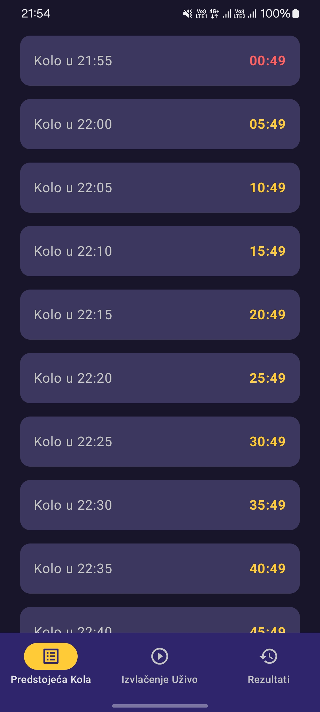
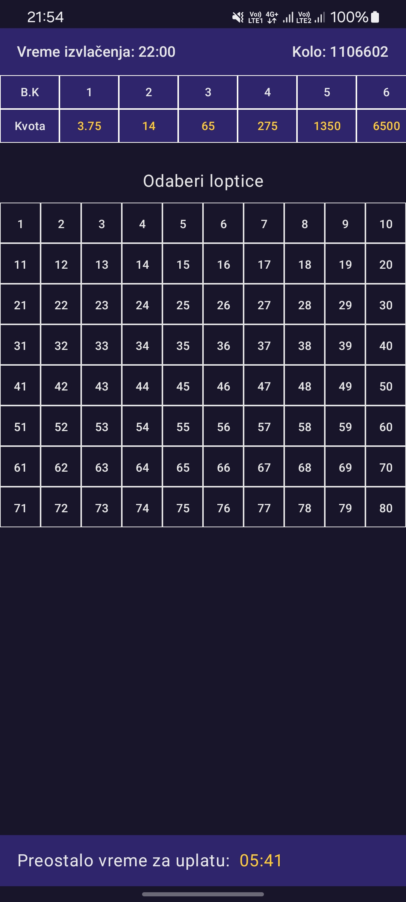
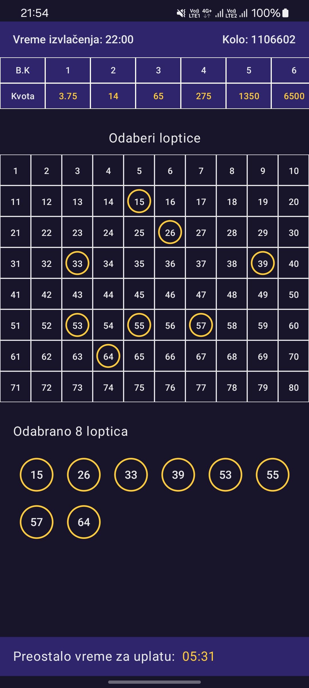
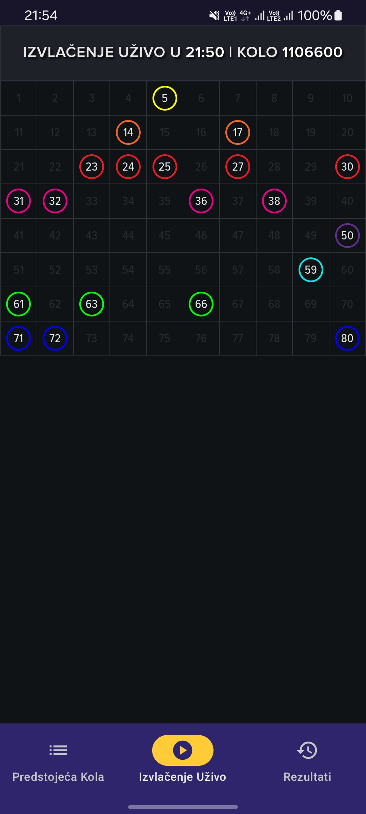
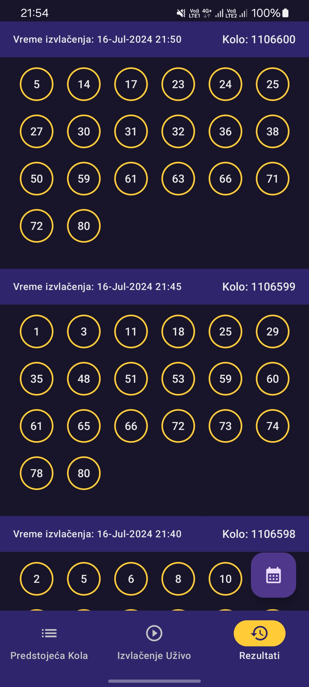
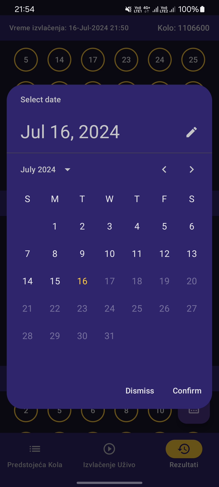
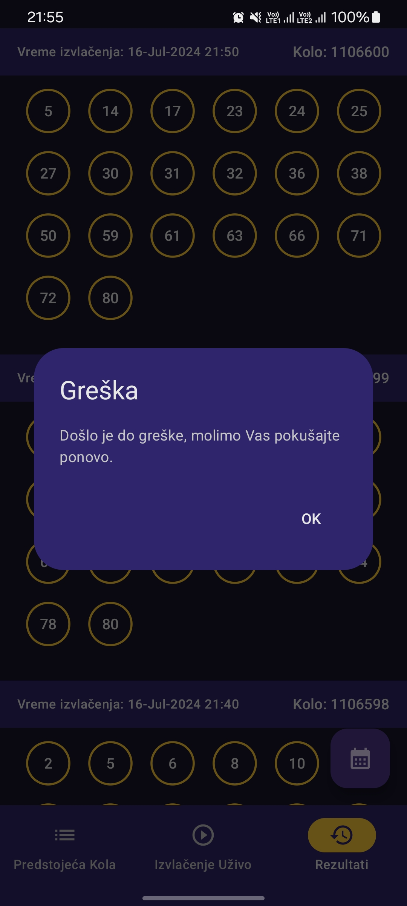
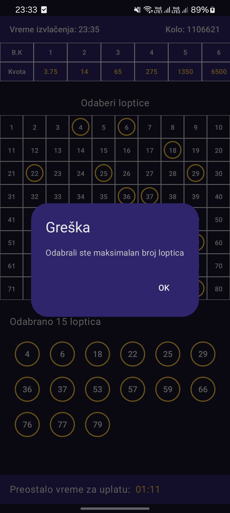

# Greek Keno

## Introduction

This is the Greek Keno game for Android.

A Greek Keno is a lottery-style game in which balls are drawn every 5 minutes. Players bet by selecting up to 15 numbers ranging from 1 to 80.

The application consists of three tabs:
- Upcoming Draws which shows 20 upcoming draws and allows user to select balls for each draw
- Live Draw which enables user to watch the current draw live
- Results which shows results of the 10 last draws. User can also choose the date by clicking on the FAB button

## Technologies and tools

- Kotlin
- Model-View-ViewModel (MVVM) architectural pattern
- Clean Architecture
- Modularization
- Hilt
- Coroutines
- Flows
- Jetpack Compose
- Mockk for unit testing
- Version Catalog

## UI

   &nbsp;
   &nbsp;
   &nbsp;
  

&nbsp;

   &nbsp;
   &nbsp;
   &nbsp;
  

